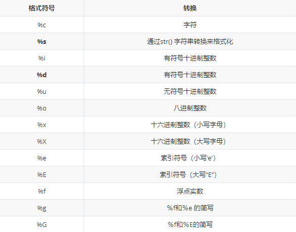
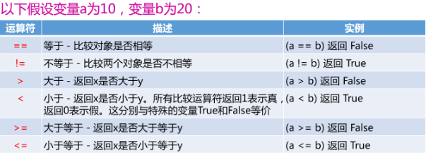
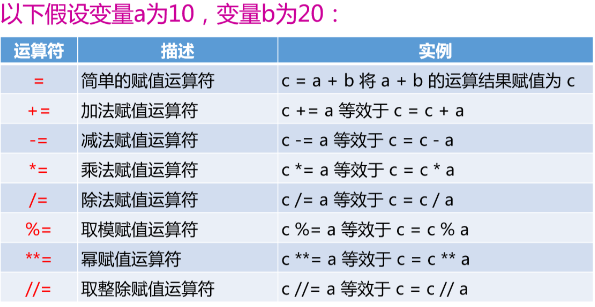
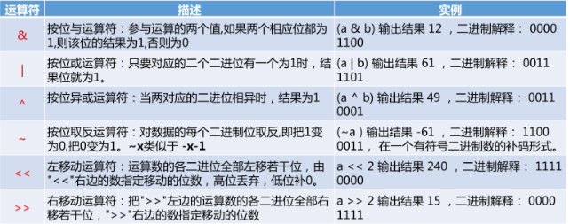
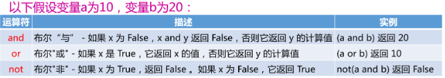
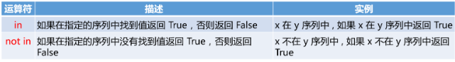
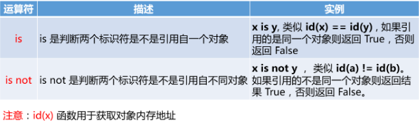
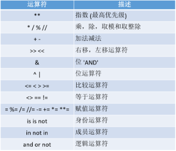

# 1.1 注释
1. 单行： #后面为注释，不可换行
2. 多行： '''  中间为注释，跨行 '''

# 1.2 变量与类型

# 1.3 标识符和关键字

# 1.4 输出

## 1.4.1 普通输出

## 1.4.2 格式化输出

## 1.4.3换行输出

# 1.5 输入

# 1.6 运算符和表达式

## 1.6.1 算术运算符

## 1.6.2 比较运算符

## 1.6.3 赋值运算符

## 1.6.4 位运算符

## 1.6.5 逻辑运算符

## 1.6.6 成员运算符

## 1.6.7 身份运算符

## 1.6.8 运算的优先级

#2.1 条件判断语句

## 2.1.1 if
 

## 2.1.2 if-else
 

## 2.1.3 elif

## 2.1.4 if 嵌套

# 2.2 循环语句

## 2.2.1 for循环
for ... in ...  遍历列表或元组

## 2.2.2 while循环

## 2.2.3 break、continue、pass

# 3.1 字符串