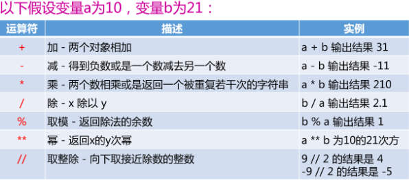

# 注释
1. 单行： #后面为注释，不可换行
2. 多行： '''  中间为注释，跨行 '''

# 变量与类型

# 标识符和关键字

# 输出

## 普通输出

## 格式化输出

## 换行输出

# 输入

# 运算符和表达式

## 算术运算符

## 比较运算符

## 赋值运算符

## 位运算符

## 逻辑运算符

## 成员运算符

## 身份运算符

## 运算的优先级

